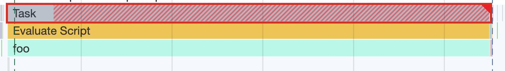

# Q14. We have refactored 3 functions that were taking too long to execute. which function will now give the browser time to respond to user input?

## ❓ Question

```js
function foo() {
  a();
  b();
  c();
}

function bar() {
  setTimeout(a);
  setTimeout(b);
  setTimeout(c);
}

function baz() {
  Promise.resolve().then(a).then(b).then(c);
}
```

- [ ] foo
- [x] bar
- [ ] baz

## 🤔 My Thinking

setTimeout을 사용하면 다른 작업을 처리할 시간을 주기 때문에 사용자 입력에 대응할 수 있다. <br />
setTimeout의 콜백은 task queue에 저장된다. task queue는 call stack에 적재되어 있는 테스크가 모두 처리가 된 뒤에 이벤트 루프에 의해 참조된다. 이때
남아 있는 테스크가 있다고 하더라도 이어서 처리하지 않은 채 이벤트 루프는 다시 순환 참조를 하게 된다. 이후 이벤트 루프가 계속 순환 참조하게 되면서 사용자의 입력을 응답 받을 수 있도록 대응할 수 있다. <br />
반면에 Promise는 Microtask queue에 저장된다. Microtask queue는 적재 된 테스크가 모두 resolve될 때까지 기다리기 때문에 사용자의 입력에 대응하기 어렵다.

## 🤓 Answer

Explanation.

```js
function foo() {
  a();
  b();
  c();
}
```

**Even if you break a large function into small ones, they will be performed as one task. The browser will not be able to interrupt to do other work.**

However, this kind of refactoring should not be underestimated. Breaking up a large function is still productive. The browser makes useful optimizations with our code. They are easier to implement on small functions. In addition, sometimes when a function is called, it turns out that the optimization performed by the browser is not suitable. Then optimization is followed by deoptimization. Optimization and deoptimization can occur several times with the same function. And the larger the function, the more resources this process will require.

```js
function bar() {
  setTimeout(a);
  setTimeout(b);
  setTimeout(c);
}
```

This is exactly what needs to be done. The function wrapped in setTimeout is not called immediately (even if delay = 0). **It is placed in the task queue. The browser has multiple queues, which allows it to prioritize certain tasks. For example, most modern browsers have a queue for responding to user interactions and give priority to tasks in that queue.** Thus, if a click occurs while the browser is executing function a, when it completes, it will switch to processing the click, and only then continue with b and c. Of course, when building such an architecture, you must take into account that the execution of your code may not be continuous.

```js
function baz() {
  Promise.resolve().then(a).then(b).then(c);
}
```

**Unlike the setTimeout, the Promise callback is queued for microtasks, not tasks. Microtasks are executed immediately after the execution of the current task, which means that the browser will not be able to interrupt to process the user action.**

To find out such long tasks, use the Chrome Dev tools.

Go to Chrome Dev tools -> Performance tab -> click Record -> perform actions on the page that use the code you want to test (e.g. page reload or a button click) -> stop recording and analyze the result.

By zooming in, you can distinguish between individual tasks. Chrome marks long tasks with a red stroke and a pop-up, which indicates the duration of the task:



## 📄 Reference
