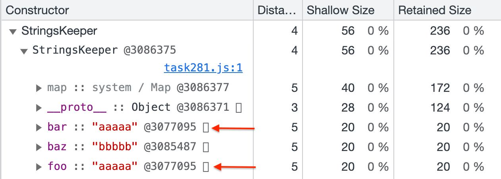

# Q16. How many strings will be stored in memory after the code is executed?

## ❓ Question

```js
function StringsKeeper() {
  this.foo = "aaaaa";
  this.bar = "aaaaa";
  this.baz = "bbbbb";
}

const obj = new StringsKeeper();
```

- [ ] 0
- [ ] 1
- [x] 2
- [ ] 3

## 🤔 My Thinking

자바스크립트에서 문자열은 불변이며 풀(pool)에 저장된다. 기존의 문자열과 같은 가진 새로운 문자열을 생성할 떄, 새로운 메모리는 할당하지 않고 대신 두 변수는 메모리 풀의
동일한 문자열을 참조한다.

풀(pool)이란 프로그래밍에서 특정 유형의 리소스를 미리 할당하거나 재사용하기 위해 관리되는 공유 리소스 집합을 의미한다.

## 🤓 Answer

Explanation.

Strings are reusable (at least in the current v8 implementation). If you create multiple variables with the same strings, only one string will be stored in memory to which both variables will refer.

To test this - run the example code, go to chrome dev tools -> memory tab -> click heap snapshot -> find the StringsKeeper constructor. You can see that the foo and bar properties refer to the same memory address (see screenshot).

This approach to storing strings is called `String Interning`.


