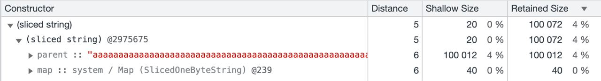

# Q17. How many bytes will the strings take after the garbage collector runs (excluding system needs)?

## ❓ Question

```js
let str = new Array(100000).join("a");
let substr = str.substring(0, 40);

str = "";
```

- [ ] 0
- [x] 40
- [ ] 100000
- [ ] 100040

## 🤔 My Thinking

str은 처음에 a 문자를 100,000번 반복한 문자열을 저장한다. 이후 substr은 원본 str에서 처음 40개의 문자를 가져와 저장한다. <br />
str에 빈 빈 문자열을 할당한 뒤에는 str이 차지하던 메모리는 가비지 컬렉터에 의해 해제될 수 있다. 그러나 substr은 여전히 메모리 40개의
a 문자를 유지하고 있으므로, 가비지 컬렉터가 동작한 후에는 이 문자들은 메모리 상에 남아 있는다.

## 🤓 Answer

Explanation.

**In the current v8 implementation, strings store references to their parent string.**
**That is, when you get a small substring from a huge string, even if you no longer use the original string, the garbage collector can't remove it because it's referenced by the created substring.**

You can check this by going to chrome developer tools -> memory tab, click heap snapshot and look for sliced ​​string (see screenshot).

Such caching speeds up work with strings, but in situations like in the example, it takes up extra memory. In this case, you can achieve cleanup of the original string by breaking the link between the parent string and the substring. **To do this, you can, for example, cast a new string to another type and then back to the string:**

```js
// 문자열을 배열로 바꾼 뒤, 다시 문자열로 합침으로써 원래의 문자열과 새로운 문자열 사이의 참조 관계를 끊음
substr = substr.split("").join("");
```

Now only a small substring will be stored in memory.


