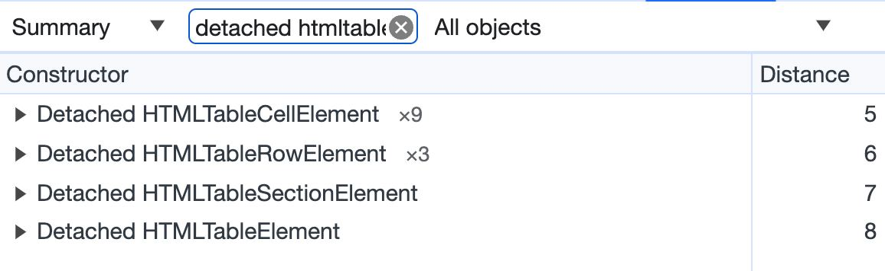

# Q18. What objects will remain in memory after the code is executed?

## ❓ Question

```js
let table = document.querySelector("table");
let cells = table.querySelectorAll("td");
let firstCell = cells[0];

console.log(firstCell.innerText);

document.body.removeChild(table);
table = null;
cells = null;
```

- [ ] table and cells elements
- [ ] all cells
- [x] first cell element
- [ ] none

## 🤔 My Thinking

firstCell 변수는 cell[0]에 대한 참조를 저장하고 있다. 따라서 `document.body.removeChild(table)`와 `table = null`, `cells = null`을 실행하여도
firstCell은 가비지 컬렉션의 대상이 되지 않는다.

## 🤓 Answer

Explanation.

Some DOM elements store references to other DOM elements.
For example, a cell stores a link to a table, and a table stores a link to cells.

Therefore, despite the fact that we deleted the table and the reference to it and also deleted the array of its cells, they remained in memory through firstCell - the only non-deleted reference to the table cell.

You can verify this if you take a screenshot in Dev Tools, Memory tab (see screenshot).


