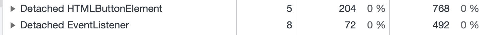

# Q7. What causes a memory leak?

## ❓ Question

```js
let button = document.getElementById("btn");

button.addEventListener("click", () => {
  console.log("click");
});

setTimeout(() => {
  // the button is located in the body
  document.body.removeChild(button);
}, 5000);
```

<br />

- [ ] none
- [ ] button
- [x] listener
- [ ] both

## 🤔 My Thinking

익명 함수는 클로저(Closure)를 형성하며, button 요소에 대한 참조를 유지한다. 클로저는 함수와 그 함수가 선언된 렉시컬 환경(Lexical Environment)에 있는 변수 사이의 연결을 의미하며, 이는 button 요소를 DOM에서 제거하더라도 이 클로저 때문에 button은 메모리 상에서 완전히 해제되지 않기 때문에 불필요한 메모리를 누수시킨다.

즉, button 요소는 DOM 트리에서 분리되지만, 이벤트 리스너(익명 함수)를 통한 참조 때문에 가비지 컬렉션되지 않는다.
메모리 누수를 방지하기 위해선, DOM 요소를 제거하기 전에 명시적으로 이벤트 리스너를 다음과 같이 제거할 수 있도록 코드를 수정할 수 있다.

<br />

```js
let button = document.getElementById("btn");

const clickHandler = () => {
  console.log("click");
};

button.addEventListener("click", clickHandler);

setTimeout(() => {
  button.removeEventListener("click", clickHandler);
  document.body.removeChild(button);
}, 5000);
```

## 🤓 Answer

Explanation.

Once an element is removed from the page, the garbage collector cannot remove it because the link to the element is referenced by the global variable button.

To check - run the code, wait for the page element to be removed, go to chrome dev tools, memory tab, click the heap snapshot button, search for detached.
You will see Detached HTMLButtonElement.

Here you can also see the Detached EventListener.

To eliminate a memory leak, it is enough to clear the variable that stores a link to it after deleting an element from the page:

setTimeout(() => {
document.body.removeChild(button);
button = null;
}, 5000);

In modern browsers, this action will also remove the event listener.
In older browsers, you need to remove the event listener explicitly:

button.removeEventListener('click');



## 📄 Reference

> https://developer.mozilla.org/ko/docs/Web/JavaScript/Closures

> https://developer.mozilla.org/en-US/docs/Web/API/EventTarget/removeEventListener
